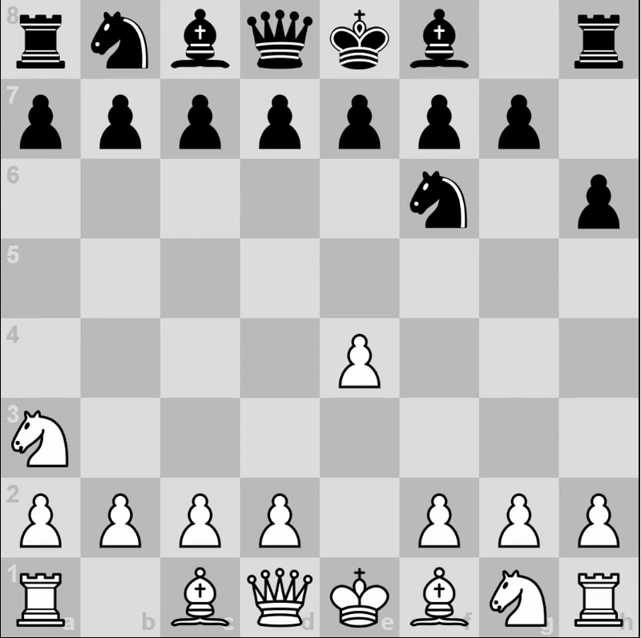

# Javascript Chess

> Chess engine made in vanilla Javascript without using any guides or help, because I think it's more fun that way.
> This project was a great challenge and a good learning experience, so I encourage everyone to try it!
>
>
>
> Engine features:
>
> - Click & Drag Pieces
> - Detects check and checkmate
> - Castling, en passant, and pawn promotion
> - Stalemate, insufficient material, fifty-move rule
> - Import and export using FEN notation
> - Undo button that can revert board completely to initial state
> - Watch the AI play each other (Only AI right now plays random moves for testing)
> - Able to detect non-pseudolegal moves and prevent moving into check
> - Can detect whether another piece is able to block check